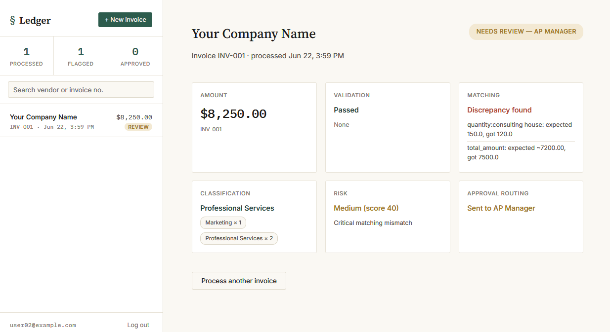

---

title: Ledger
emoji: 🚀
colorFrom: blue
colorTo: indigo
sdk: docker
app_port: 7860
pinned: false
---

# Ledger Backend

AI-powered finance backend.

# Reconcile

An agentic invoice processing pipeline for extraction, validation, 3-way matching, risk scoring, and approval routing.

Built with LangGraph, FastAPI, Gemini, Supabase, and a live streaming frontend.

---

## Live Demo

* Frontend: https://reconcile-kqsc.vercel.app/

### Demo Video

[Watch the demo](https://github.com/user-attachments/assets/ea76ca30-04f7-4181-b14d-160f1cb8366a)

### Final Processed Invoice UI

<!-- Add screenshot here -->



---

## What Reconcile Does

Reconcile processes invoices the way real accounts-payable teams do:

1. Extract structured fields from uploaded documents
2. Validate invoice integrity
3. Detect duplicates
4. Perform 3-way matching against PO + GR
5. Classify expense category
6. Score invoice risk
7. Route for approval
8. Generate a complete audit-trail report

Every stage runs as a node inside a LangGraph workflow and streams live results to the frontend via Server-Sent Events.

Invalid or duplicate invoices short-circuit early instead of wasting downstream compute.

---

## Pipeline

```text
Upload Invoice (+ optional PO / GR)
        │
        ▼
1. Extraction
        │
        ▼
2. Validation
        │
        ▼
3. Duplicate Detection
        │
        ▼
4. 3-Way Matching
        │
        ▼
5. Classification
        │
        ▼
6. Risk Scoring
        │
        ▼
7. Approval Routing
        │
        ▼
8. Audit Report Generation
```

---

## Core Features

### Structured Document Extraction

Uses Gemini multimodal extraction with schema-constrained outputs for invoices, purchase orders, and goods receipts.

### 3-Way Matching

Compares:

* Invoice
* Purchase Order
* Goods Receipt

Line-by-line with configurable tolerances and severity-tagged discrepancies.

### Risk-Aware Approval Routing

Low-risk matched invoices can auto-approve, while flagged invoices route for review.

### Live Streaming Pipeline

Each agent streams results in real time to the frontend ledger UI using SSE.

### Auditability

Every stage produces an inspectable output rather than a single opaque response.

---

## Tech Stack

| Layer         | Tech                         |
| ------------- | ---------------------------- |
| Orchestration | LangGraph                    |
| Extraction    | Gemini + LangChain           |
| Backend       | FastAPI                      |
| Streaming     | Server-Sent Events           |
| Database      | Supabase (PostgreSQL)        |
| Auth          | JWT + bcrypt                 |
| Frontend      | HTML / CSS / JavaScript      |
| Deployment    | Vercel + Hugging Face Spaces |

---

## Architecture

```text
Frontend (Vercel)
        │
        ▼
FastAPI Backend (HF Spaces)
        │
        ├── LangGraph Workflow
        ├── Gemini Extraction
        ├── Matching + Risk Engine
        └── SSE Streaming
                │
                ▼
        Supabase PostgreSQL
```

---

## Project Structure

```text
backend/
  app/
    main.py
    agent.py
    auth.py
    auth_db.py
    db.py
    extracter.py
    validator.py
    matching.py
    classify.py
    risk_analysis.py
    approval.py
    report.py

frontend/
  index.html
  style.css
  app.js
```

---

## Running Locally

### Backend

```bash
cd backend
pip install -r requirements.txt
uvicorn app.main:app --reload
```

Create a `.env` file:

```env
API_KEY=your_gemini_api_key
MODEL_NAME=gemini-2.5-flash
DB_URL=your_supabase_postgres_url
JWT_SECRET=your_secret
```

### Frontend

```bash
cd frontend
python -m http.server 8080
```

Open:

```text
http://localhost:8080
```

---

## Honest Limitations

This is a portfolio/demo project rather than a production AP platform.

Current limitations include:

* Rules-based expense classification
* No ERP integrations
* Synchronous pipeline execution
* Limited historical/vendor-aware risk modeling
* Matching tuned for common invoice structures rather than highly noisy enterprise documents

---

## Why This Project Exists

Most invoice AI demos stop at OCR extraction.

The interesting operational problem is verifying whether the invoice should actually be paid.

Reconcile focuses on the workflow layer:
validation, matching, auditability, and approval orchestration.

---

## Future Improvements

* Async/concurrent pipeline execution
* Human review dashboard
* ERP integrations
* Vendor behavior profiling
* Configurable approval policies
* Analytics + monitoring
* Confidence scoring
* Advanced document handling for noisy scans

---
